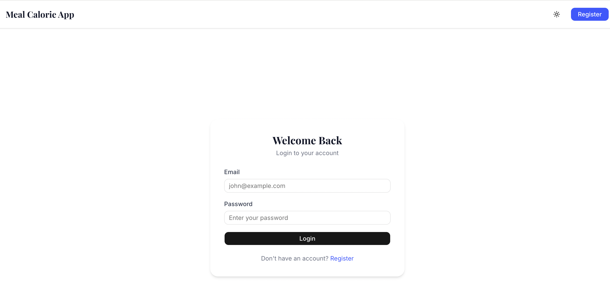
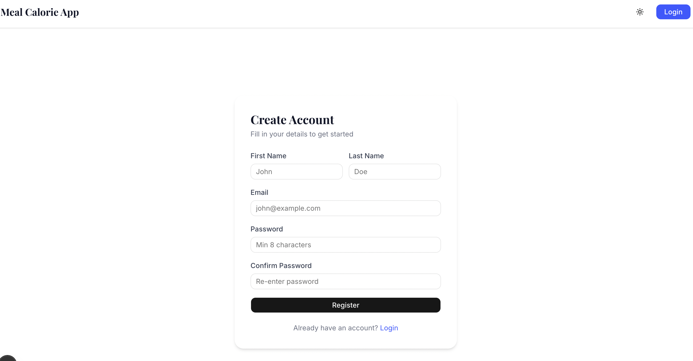
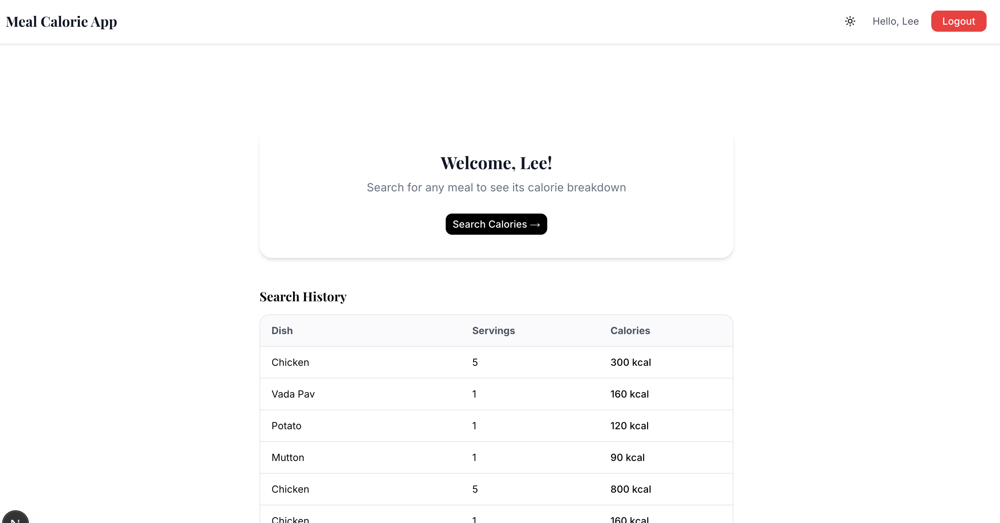
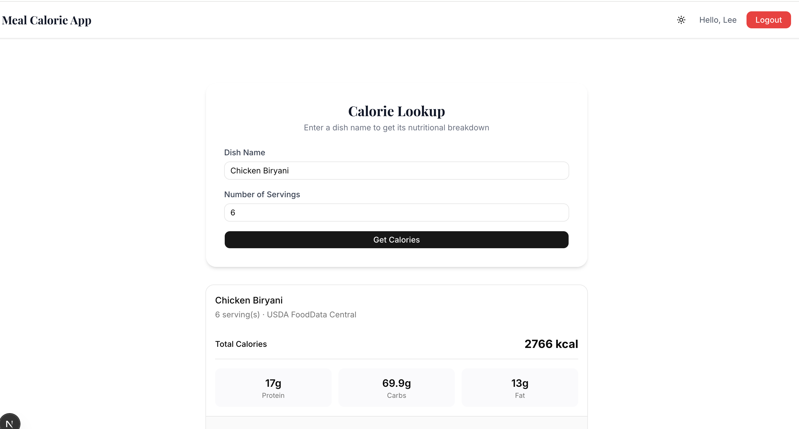

This is a [Next.js](https://nextjs.org) project bootstrapped with [`create-next-app`](https://nextjs.org/docs/app/api-reference/cli/create-next-app).

# Meal Calorie Count Generator
This is Next.js project where user can Register / Login into their account. User can see and search any dish calories and nutrition.

---
### Screenshots





## What is there in this Project
- User can Register and Login
- Authentication with JWT token
- Only the logged in can access the dashboard
- User can search any dish calorie data
- Dark and Light mode is there
- User can track his old search history as well

---

## Tech stack used in this project
- **Next.js 14** — Main framework
- **TypeScript** — For type safety
- **Tailwind CSS** — For Styling
- **shadcn/ui** — Ready made UI components
- **Zustand** — To manage the App state
- **React Hook Form + Zod** — For form validation
- **next-themes** — For Dark/Light mode 

---

## How to run locally

### Requirements
- Node.js v22.17.1
- pnpm

### Steps

**1. Clone it**
```bash
git clone 
cd meal-calorie-frontend-shahid
```

**2. Install the dependencies**
```bash
pnpm install
```

**3. Setup Environment file**

Create a `.env.local` file in the root folder:
```bash
NEXT_PUBLIC_API_BASE_URL=https://xpcc.devb.zeak.io/api
```

**4. Run the development server**
```bash
pnpm dev
```

Open `http://localhost:3000` in your browser.

---
## Folder Structure
```
src/
|-- app/
|   |-- login/
|   |-- register/
|   |-- dashboard/
|   |-- calories/
|
|-- components/
|   |-- ui/
|   |-- Navbar.tsx/
|   |-- FormField.tsx/
|   |-- MealForm.tsx/
|   |-- ResultCard.tsx/
|   |-- MealHistoryTable.tsx/
|
|-- hooks/
|   |-- useAuthGuard.ts/
|
|-- lib/
|   |-- api.ts
|   |-- validations.ts/
|
|-- store/
|   |-- authStore.ts/
|   |-- mealStore.ts/
|
|-- types/
|   |-- index.ts/

```
---
## API
Backend URL: `https://xpcc.devb.zeak.io/api`
| Method | Endpoint|
| --- | --- |
| POST | `/auth/register` |
| POST | `/auth/login` |
| POST | `/get-calories` |

---
## What I learned from this project
- Next.js App Router structure
- With Zustand global state management
- To persist JWT token into localStorage
- How to build protected routes
- Form validation with Zod
- TypeScript types define
- Dark mode implementation
- API errors handling

---
